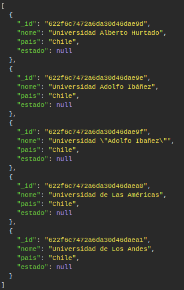
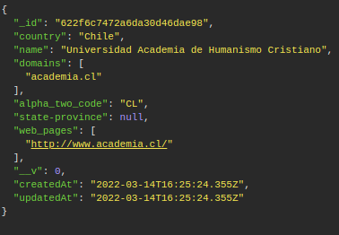
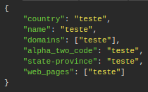
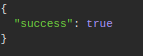
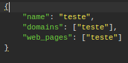

**INFORMAÇÕES PARA SETUP**

-   **PRÉ REQUISITOS**
    -   versão do node >= 16.0
    -   versão do npm >= 8.0
    -   lembre-se de dar o comando '**npm i**' no diretório raíz do projeto antes de executar o código na produção

-   **MONGO**
    -   [Suba uma instância do mongo localmente](https://www.mongodb.com/try/download) ou use um que ja tenha sido criado
    -   Coloque a URI do mongo que decidiu usar dentro de './model/dbData.json' no atributo '**uri**'
    -   caso tenha dúvidas sobre a URI do seu Mongo dê uma olhada em alguns exemplos da documentação [aqui](https://docs.mongodb.com/manual/reference/connection-string/)
    -   OBS: tenha certeza de passar a URI correta, caso o contrário a aplicação não conseguirá se conectar ao banco

-   **API REST INFOS**
    -   **PAGINAÇÃO INFOS**
        -   ATENÇÃO 
            -   por padrão o método GET está limitado a retornar até 20 registros, caso queira pegar todos, é necessesário passar o atributo **allRegistries** como um [parametro de query](https://guides.emberjs.com/release/routing/query-params/) na url, 
                -   o atributo **allRegistries** recebe um valor booleano
            -   para definir o número da página é nessário passar o atributo **page** como um [parametro de query](https://guides.emberjs.com/release/routing/query-params/) na url, por padrão será retornado a página 1
            -   para definir o número de registros retornados por página é nessário passar o atributo **registriesPerPage** como um [parametro de query](https://guides.emberjs.com/release/routing/query-params/) na url, por padrão será retornado 20 registros
    -   O servidor irá rodar na porta 3001, mas caso necessite trocar você pode ser editar a porta em './routes/Routes.js'

-   **EXECUTANDO**
    -   Para iniciar o servidor de o comando '**node index.js**' na pasta raiz do projeto
    -   (OBS: não se esqueça de executar o **npm i** antes)

-   **EXEMPLOS DE REQUISISÃO**
    -   **GET**
        -   **REQUISIÇÃO**
            -   [http://localhost:3001/universities?page=1&registriesPerPage=5](http://localhost:3001/universities?page=1&registriesPerPage=5)
        -   **RESPOSTA**
            -   
    -   **GET BY ID**
        -   **REQUISIÇÃO**
            -   [http://localhost:3001/universities/622f6c7472a6da30d46dae98](http://localhost:3001/universities/622f6c7472a6da30d46dae98)
        -   **RESPOSTA**
            -   
    -   **POST**
        -   **REQUISIÇÃO**
            -   [http://localhost:3001/universities](http://localhost:3001/universities)
            -   
        -   **RESPOSTA**
            -   
    -   **PUT**
        -   **REQUISIÇÃO**
            -   [http://localhost:3001/universities/622f6c7472a6da30d46dae98](http://localhost:3001/universities/622f6c7472a6da30d46dae98)
            -   
        -   **RESPOSTA**
            -   
    -   **DELETE**
        -   **REQUISIÇÃO**
            -   [http://localhost:3001/universities/622f6c7472a6da30d46dae98](http://localhost:3001/universities/622f6c7472a6da30d46dae98)
        -   **RESPOSTA**
            -   